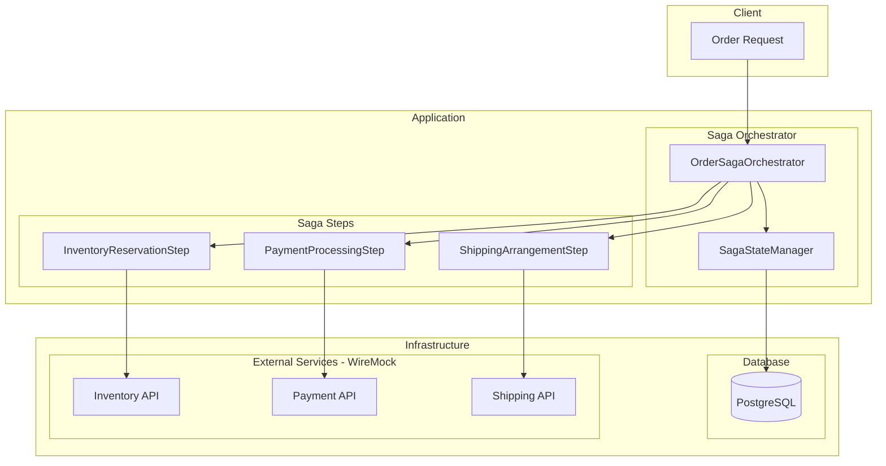
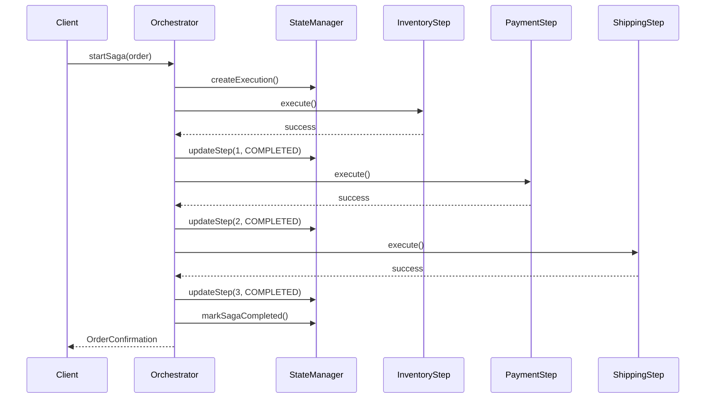

# Implementation Plan: SAGA-001 - Complete a Multi-Step Order Process

## Overview

Implement the core saga orchestration for processing orders through multiple steps (inventory reservation, payment, shipping) with a single confirmation upon successful completion.

## Architecture



## Infrastructure

> **Prerequisites:** See [000-infrastructure.md](./000-infrastructure.md) for Docker Compose setup.

### External Services (WireMock)

Each saga step integrates with external services mocked via WireMock at `http://localhost:8081`:

| Step | Service | Endpoint |
|------|---------|----------|
| InventoryReservationStep | Inventory API | `POST /api/inventory/reservations` |
| PaymentProcessingStep | Payment API | `POST /api/payments/authorize` |
| ShippingArrangementStep | Shipping API | `POST /api/shipments` |

### Database (PostgreSQL)

Saga state is persisted to PostgreSQL at `localhost:5432/saga_db`:

| Table | Purpose |
|-------|---------|
| `orders` | Order records |
| `order_items` | Line items |
| `saga_executions` | Saga execution tracking |
| `saga_step_results` | Step outcomes |

## Implementation Steps

### 1. Define Core Domain Models

#### 1.1 Create Order Entity

| Field | Type | Description |
|-------|------|-------------|
| id | UUID | Unique order identifier |
| customerId | UUID | Reference to customer |
| items | List<OrderItem> | Products being ordered |
| totalAmount | BigDecimal | Order total |
| status | OrderStatus | Current order state |
| createdAt | Instant | Creation timestamp |
| updatedAt | Instant | Last update timestamp |

#### 1.2 Create OrderStatus Enum

```
PENDING → PROCESSING → COMPLETED
                    ↘ FAILED
                    ↘ COMPENSATING
                    ↘ COMPENSATED
```

| Status | Description |
|--------|-------------|
| PENDING | Order created, saga not started |
| PROCESSING | Saga execution in progress |
| COMPLETED | All steps successful |
| FAILED | One or more steps failed |
| COMPENSATING | Rollback in progress |
| COMPENSATED | Rollback complete |

#### 1.3 Create SagaExecution Entity

| Field | Type | Description |
|-------|------|-------------|
| id | UUID | Saga execution identifier |
| orderId | UUID | Associated order |
| currentStep | Int | Index of current step |
| status | SagaStatus | Overall saga status |
| startedAt | Instant | When saga began |
| completedAt | Instant? | When saga finished |

### 2. Implement Saga Step Interface

#### 2.1 Define SagaStep Interface

- **execute(context: SagaContext): Mono<StepResult>** - Forward action
- **compensate(context: SagaContext): Mono<CompensationResult>** - Rollback action
- **getStepName(): String** - Human-readable step name
- **getStepOrder(): Int** - Execution order

#### 2.2 Define StepResult

| Field | Type | Description |
|-------|------|-------------|
| success | Boolean | Whether step succeeded |
| data | Map<String, Any> | Data to pass to next steps |
| errorMessage | String? | Error details if failed |

### 3. Implement Individual Saga Steps

#### 3.1 InventoryReservationStep

**Execute:**
1. Validate all order items exist in catalog
2. Check stock availability for each item
3. Create inventory reservations with expiration
4. Record reservation IDs in saga context

**Compensate:**
1. Retrieve reservation IDs from saga context
2. Release each reservation
3. Restore stock quantities

#### 3.2 PaymentProcessingStep

**Execute:**
1. Retrieve customer payment method
2. Calculate final amount (including taxes/fees)
3. Authorize payment (hold funds)
4. Record authorization ID in saga context

**Compensate:**
1. Retrieve authorization ID from saga context
2. Void/release authorization
3. No actual charge to reverse (auth only)

#### 3.3 ShippingArrangementStep

**Execute:**
1. Determine shipping method based on order
2. Calculate delivery estimates
3. Create shipment record
4. Reserve carrier capacity (if applicable)
5. Record shipment ID in saga context

**Compensate:**
1. Retrieve shipment ID from saga context
2. Cancel shipment arrangement
3. Release carrier reservation

### 4. Implement Saga Orchestrator

#### 4.1 Create OrderSagaOrchestrator



#### 4.2 Orchestrator Responsibilities

1. **Initialize saga execution**
   - Create SagaExecution record
   - Initialize SagaContext with order data
   - Set order status to PROCESSING

2. **Execute steps sequentially**
   - Iterate through ordered steps
   - Pass context between steps
   - Update state after each step

3. **Handle successful completion**
   - Mark saga as COMPLETED
   - Update order status to COMPLETED
   - Generate confirmation details
   - Return success response

4. **Delegate to compensation on failure** (covered in SAGA-002)

### 5. Implement SagaContext

#### 5.1 Context Structure

| Field | Type | Description |
|-------|------|-------------|
| orderId | UUID | Order being processed |
| sagaExecutionId | UUID | Current saga execution |
| stepData | MutableMap<String, Any> | Data passed between steps |
| completedSteps | MutableList<String> | Successfully executed steps |

#### 5.2 Context Operations

- **putData(key, value)** - Store data for later steps
- **getData(key)** - Retrieve data from earlier steps
- **markStepCompleted(stepName)** - Record step completion
- **getCompletedSteps()** - List completed steps for compensation

### 6. Create API Endpoint

#### 6.1 POST /api/orders

**Request:**
```json
{
  "customerId": "uuid",
  "items": [
    { "productId": "uuid", "quantity": 2 }
  ],
  "shippingAddress": { ... },
  "paymentMethodId": "uuid"
}
```

**Response (Success):**
```json
{
  "orderId": "uuid",
  "status": "COMPLETED",
  "confirmationNumber": "ORD-2024-XXXXX",
  "estimatedDelivery": "2024-01-15",
  "totalCharged": 99.99
}
```

#### 6.2 Controller Implementation

1. Validate request payload
2. Create Order entity in PENDING status
3. Invoke OrderSagaOrchestrator.startSaga()
4. Return appropriate response based on saga result

### 7. Implement Reactive Flow

#### 7.1 Use Project Reactor

- All step executions return `Mono<StepResult>`
- Chain steps using `flatMap` for sequential execution
- Use `onErrorResume` for failure handling
- Leverage coroutines for cleaner async code

#### 7.2 Example Flow

```kotlin
fun executeSaga(order: Order): Mono<SagaResult> {
    return createExecution(order)
        .flatMap { ctx -> inventoryStep.execute(ctx) }
        .flatMap { ctx -> paymentStep.execute(ctx) }
        .flatMap { ctx -> shippingStep.execute(ctx) }
        .flatMap { ctx -> completeSaga(ctx) }
        .onErrorResume { error -> handleFailure(error) }
}
```

## File Structure

```
src/main/kotlin/com/pintailconsultingllc/sagapattern/
├── domain/
│   ├── Order.kt
│   ├── OrderItem.kt
│   ├── OrderStatus.kt
│   └── SagaExecution.kt
├── saga/
│   ├── SagaStep.kt
│   ├── SagaContext.kt
│   ├── SagaResult.kt
│   ├── StepResult.kt
│   ├── OrderSagaOrchestrator.kt
│   └── steps/
│       ├── InventoryReservationStep.kt
│       ├── PaymentProcessingStep.kt
│       └── ShippingArrangementStep.kt
├── service/
│   ├── OrderService.kt
│   ├── InventoryService.kt
│   ├── PaymentService.kt
│   └── ShippingService.kt
├── repository/
│   ├── OrderRepository.kt
│   └── SagaExecutionRepository.kt
└── api/
    ├── OrderController.kt
    └── dto/
        ├── CreateOrderRequest.kt
        └── OrderResponse.kt
```

## Testing Strategy

### Unit Tests

- Each saga step tested in isolation
- Mock WebClient calls to external services
- Test success and failure paths
- Verify context data propagation

### Integration Tests

Run with Docker Compose infrastructure (`docker compose up -d`):

- Full saga execution against PostgreSQL
- WireMock stubs for external service responses
- Verify order status transitions in database
- Confirm all steps execute in order
- Validate response structure

### Test Scenarios with WireMock

| Scenario | WireMock Trigger | Expected Outcome |
|----------|------------------|------------------|
| Happy path | Default stubs | Order COMPLETED |
| Inventory failure | `productId: out-of-stock-product` | Order FAILED, no steps to compensate |
| Payment failure | `paymentMethodId: declined-card` | Order COMPENSATED, inventory released |
| Shipping failure | `postalCode: 00000` | Order COMPENSATED, inventory + payment reversed |

## Dependencies on Other Stories

| Story | Dependency Type | Description |
|-------|----------------|-------------|
| SAGA-002 | Required | Compensation logic on failure |
| SAGA-003 | Optional | Status tracking during execution |
| SAGA-005 | Optional | History recording |

## Acceptance Criteria Verification

| Criteria | Implementation |
|----------|----------------|
| Order processed through all steps | Sequential step execution in orchestrator |
| Confirmation only on full completion | Response generated after all steps succeed |
| All records reflect completed state | Order and SagaExecution updated atomically |
