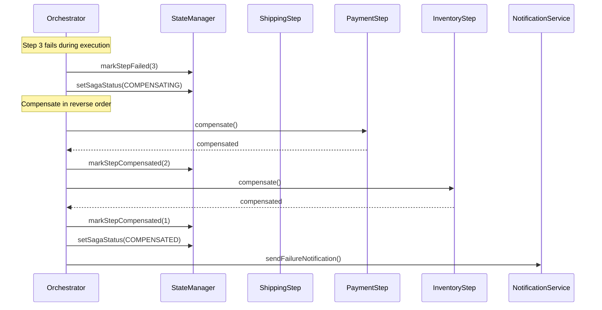
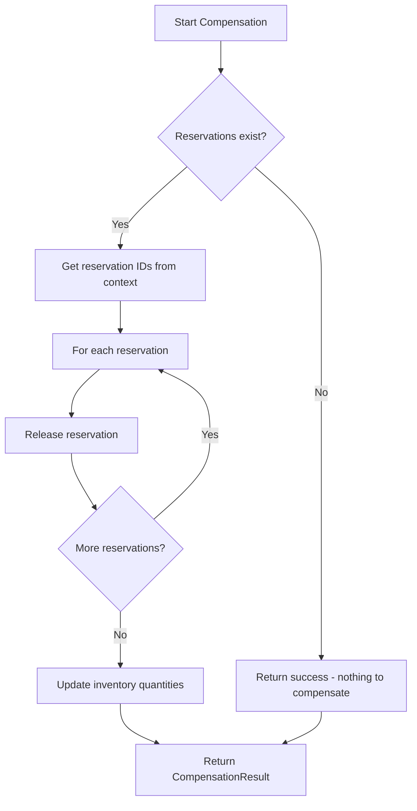
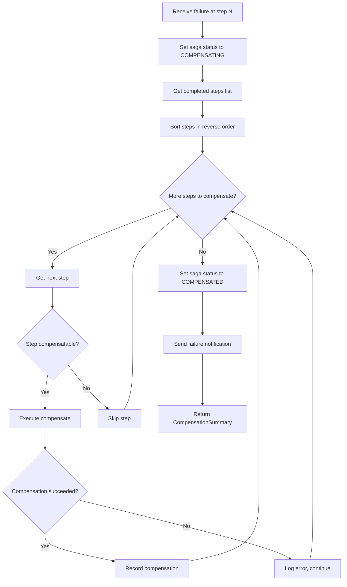
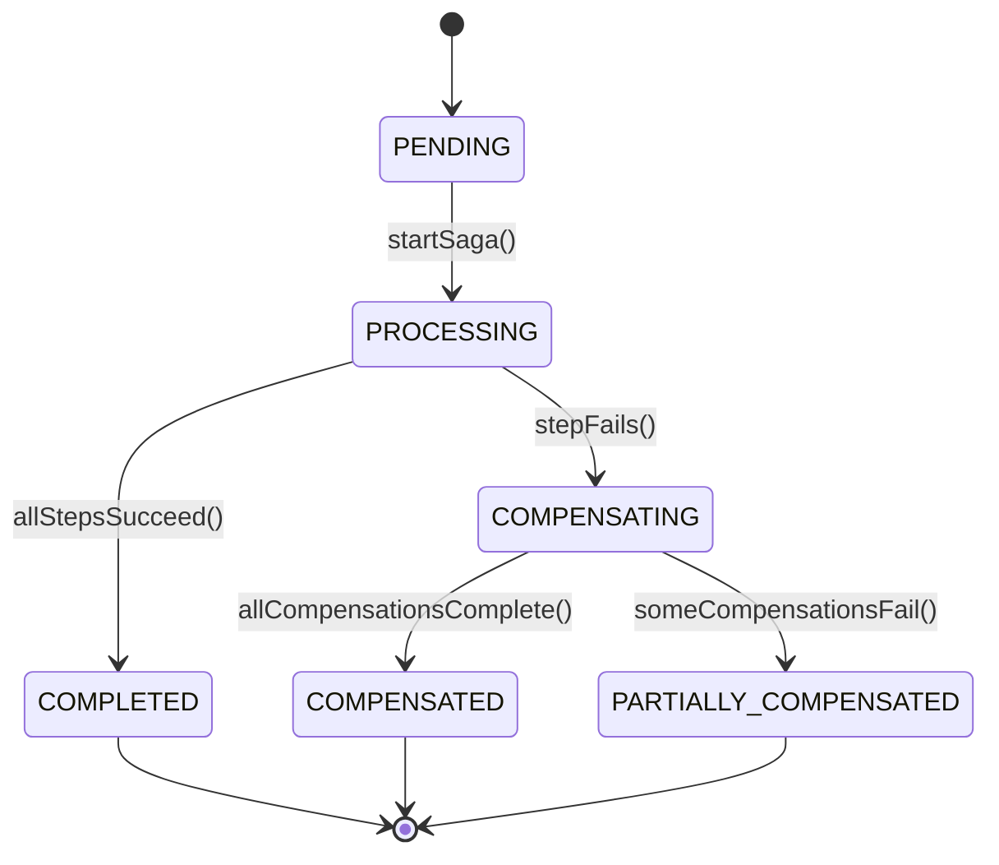
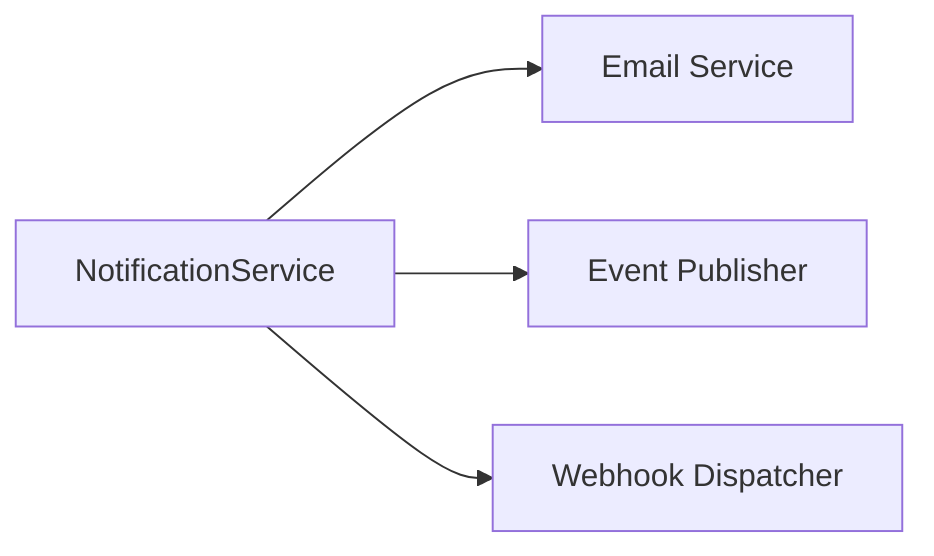

# Implementation Plan: SAGA-002 - Automatic Rollback on Failure

## Overview

Implement compensation logic that automatically reverses all previously completed steps when any step in the saga fails, ensuring no partial charges or orphaned state remains.

## Infrastructure

> **Prerequisites:** See [000-infrastructure.md](./000-infrastructure.md) for Docker Compose setup.

### Compensation Endpoints (WireMock)

Each saga step's compensation calls reversal endpoints on the external services:

| Step | Compensation Action | Endpoint |
|------|---------------------|----------|
| InventoryReservationStep | Release reservation | `DELETE /api/inventory/reservations/{id}` |
| PaymentProcessingStep | Void authorization | `POST /api/payments/authorizations/{id}/void` |
| ShippingArrangementStep | Cancel shipment | `POST /api/shipments/{id}/cancel` |

### Database Tables

Compensation state tracked in PostgreSQL:

| Table | Compensation Fields |
|-------|---------------------|
| `saga_executions` | `failed_step`, `failure_reason`, `compensation_started_at`, `compensation_completed_at` |
| `saga_step_results` | `status` (COMPENSATED), `completed_at` |

## Compensation Flow



## Implementation Steps

### 1. Extend SagaStep Interface for Compensation

#### 1.1 Compensation Method Contract

```kotlin
interface SagaStep {
    fun execute(context: SagaContext): Mono<StepResult>
    fun compensate(context: SagaContext): Mono<CompensationResult>
    fun getStepName(): String
    fun getStepOrder(): Int
    fun isCompensatable(): Boolean  // Some steps may not need compensation
}
```

#### 1.2 CompensationResult Structure

| Field | Type | Description |
|-------|------|-------------|
| success | Boolean | Whether compensation succeeded |
| stepName | String | Step that was compensated |
| details | String? | Additional compensation details |
| errorMessage | String? | Error if compensation failed |

### 2. Implement Step Compensation Logic

#### 2.1 InventoryReservationStep Compensation



**Implementation Details:**
1. Retrieve `reservationIds` from SagaContext
2. For each reservation:
   - Call InventoryService.releaseReservation(id)
   - Restore available stock quantity
3. Log compensation action
4. Return CompensationResult with released count

#### 2.2 PaymentProcessingStep Compensation

| Scenario | Action |
|----------|--------|
| Authorization exists | Void the authorization |
| Capture completed | Initiate refund (out of scope for MVP) |
| No authorization | Nothing to compensate |

**Implementation Details:**
1. Retrieve `authorizationId` from SagaContext
2. If authorization exists:
   - Call PaymentService.voidAuthorization(id)
   - Verify void confirmation
3. Log compensation with authorization details
4. Return CompensationResult

#### 2.3 ShippingArrangementStep Compensation

**Implementation Details:**
1. Retrieve `shipmentId` from SagaContext
2. If shipment exists:
   - Call ShippingService.cancelShipment(id)
   - Release any carrier reservations
3. Log cancellation details
4. Return CompensationResult

### 3. Implement Compensation Orchestration

#### 3.1 CompensationOrchestrator

```kotlin
class CompensationOrchestrator(
    private val steps: List<SagaStep>,
    private val stateManager: SagaStateManager,
    private val notificationService: NotificationService
) {
    fun compensate(
        context: SagaContext,
        failedStepIndex: Int,
        failureReason: String
    ): Mono<CompensationSummary>
}
```

#### 3.2 Compensation Algorithm



#### 3.3 Handling Compensation Failures

| Scenario | Handling |
|----------|----------|
| Compensation step fails | Log error, continue with remaining compensations |
| Multiple compensation failures | Aggregate errors, alert operations |
| Network timeout | Retry with exponential backoff |
| Unrecoverable failure | Mark for manual intervention |

### 4. Update SagaStateManager

#### 4.1 Additional State Fields

| Field | Type | Description |
|-------|------|-------------|
| failedStep | Int? | Index of step that failed |
| failureReason | String? | Why the saga failed |
| compensationStartedAt | Instant? | When compensation began |
| compensationCompletedAt | Instant? | When compensation finished |
| compensatedSteps | List<String> | Steps successfully compensated |

#### 4.2 State Transitions



### 5. Implement Failure Detection

#### 5.1 StepResult Failure Indicators

```kotlin
sealed class StepResult {
    data class Success(val data: Map<String, Any>) : StepResult()
    data class Failure(
        val errorCode: String,
        val message: String,
        val retryable: Boolean,
        val details: Map<String, Any>?
    ) : StepResult()
}
```

#### 5.2 Common Failure Types

| Error Code | Description | Retryable |
|------------|-------------|-----------|
| INVENTORY_UNAVAILABLE | Insufficient stock | No |
| PAYMENT_DECLINED | Payment method rejected | No |
| PAYMENT_TIMEOUT | Payment service timeout | Yes |
| SHIPPING_UNAVAILABLE | Cannot ship to address | No |
| SERVICE_ERROR | Internal service error | Yes |

### 6. Implement Notification Service

#### 6.1 Failure Notification Content

| Field | Description |
|-------|-------------|
| orderId | Order that failed |
| failureStep | Which step failed |
| failureReason | Human-readable explanation |
| compensationStatus | What was rolled back |
| nextSteps | What customer can do |

#### 6.2 Notification Channels



**Implementation:**
1. Build failure notification payload
2. Publish domain event (OrderSagaFailed)
3. Send customer email with details
4. Optionally invoke webhooks for integrations

### 7. Update API Response for Failures

#### 7.1 Failure Response Structure

```json
{
  "orderId": "uuid",
  "status": "FAILED",
  "error": {
    "code": "PAYMENT_DECLINED",
    "message": "Your payment method was declined",
    "failedStep": "Payment Processing",
    "retryable": false
  },
  "compensation": {
    "status": "COMPLETED",
    "reversedSteps": ["Inventory Reservation"]
  },
  "suggestions": [
    "Update your payment method",
    "Try a different card"
  ]
}
```

### 8. Implement Idempotent Compensation

#### 8.1 Idempotency Strategy

| Step | Idempotency Key | Behavior |
|------|-----------------|----------|
| Inventory | reservationId | Check if already released before releasing |
| Payment | authorizationId | Check if already voided before voiding |
| Shipping | shipmentId | Check if already cancelled before cancelling |

#### 8.2 Implementation Pattern

```kotlin
fun compensate(context: SagaContext): Mono<CompensationResult> {
    val reservationId = context.getData("reservationId") as? String
        ?: return Mono.just(CompensationResult.nothingToCompensate())

    return inventoryService.getReservation(reservationId)
        .flatMap { reservation ->
            if (reservation.status == RELEASED) {
                Mono.just(CompensationResult.alreadyCompensated())
            } else {
                inventoryService.releaseReservation(reservationId)
                    .map { CompensationResult.success() }
            }
        }
}
```

## File Structure (Additional)

```
src/main/kotlin/com/pintailconsultingllc/sagapattern/
├── saga/
│   ├── compensation/
│   │   ├── CompensationOrchestrator.kt
│   │   ├── CompensationResult.kt
│   │   └── CompensationSummary.kt
│   └── ...
├── notification/
│   ├── NotificationService.kt
│   ├── FailureNotification.kt
│   └── EmailTemplates.kt
└── event/
    ├── OrderSagaFailed.kt
    └── DomainEventPublisher.kt
```

## Testing Strategy

### Unit Tests

- Test each step's compensate() method
- Mock services to simulate compensation scenarios
- Verify idempotency of compensation operations

### Integration Tests

| Test Case | Description |
|-----------|-------------|
| Payment fails | Verify inventory released after payment failure |
| Shipping fails | Verify both payment and inventory compensated |
| Compensation fails | Verify partial compensation handled gracefully |
| Double compensation | Verify idempotency prevents duplicate reversals |

### Chaos Testing

- Inject failures at each step
- Verify complete rollback
- Measure compensation timing

## Dependencies

| Story | Relationship |
|-------|--------------|
| SAGA-001 | Builds on step execution |
| SAGA-003 | Status updates during compensation |
| SAGA-005 | History records compensation events |

## Acceptance Criteria Verification

| Criteria | Implementation |
|----------|----------------|
| Automatic cancellation on failure | CompensationOrchestrator triggers automatically |
| All completed steps reversed | Reverse iteration through completedSteps |
| Customer receives failure notification | NotificationService sends email with details |
| No partial charges remain | PaymentStep compensation voids authorization |
| No orphaned reservations | InventoryStep compensation releases reservations |
