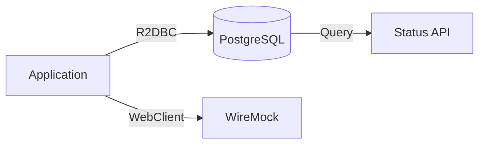
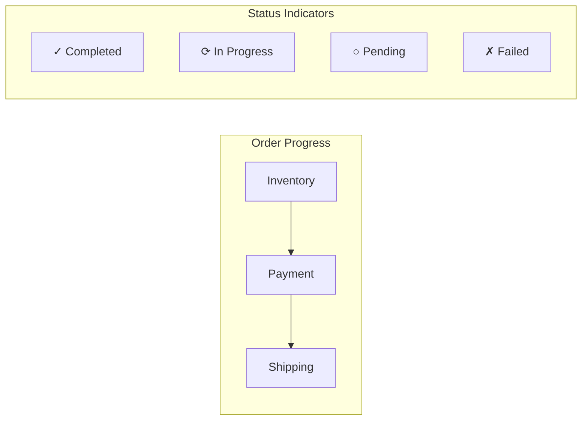
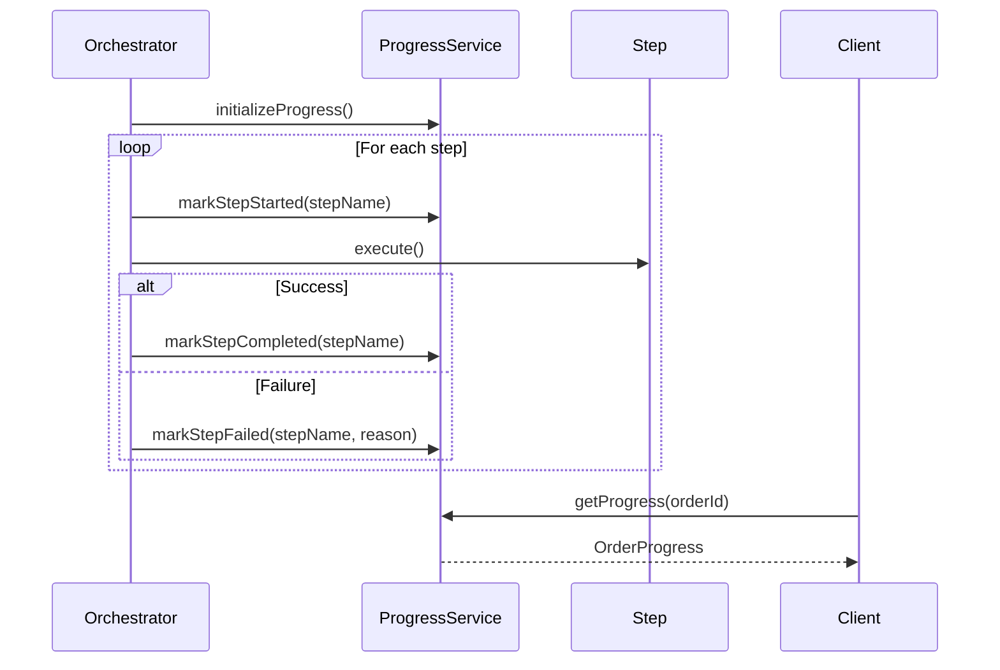
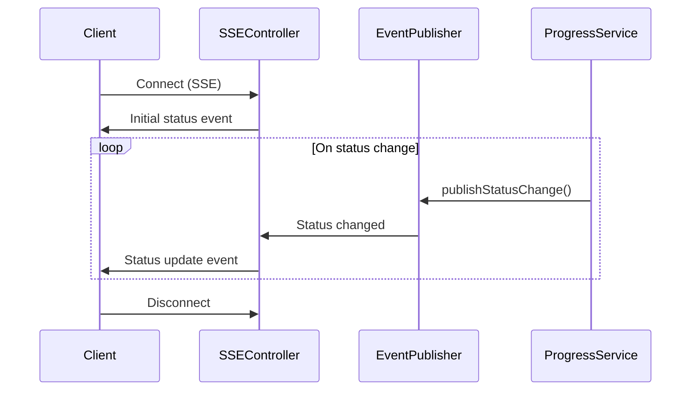
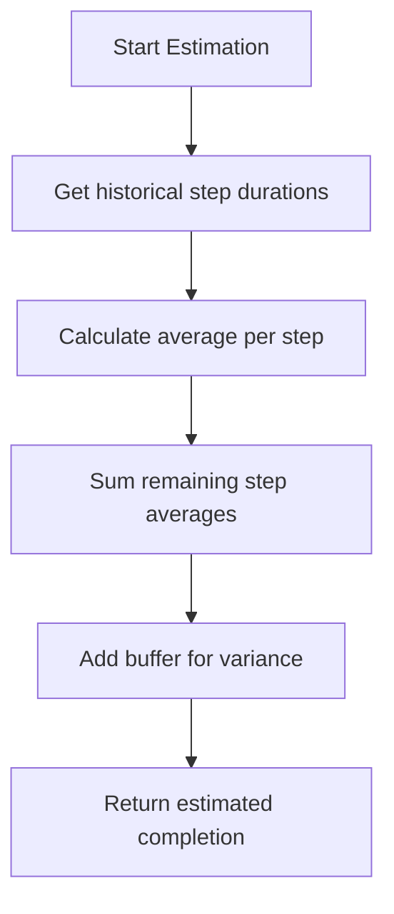

# Implementation Plan: SAGA-003 - View Order Status During Processing

## Status: COMPLETED

**Completed:** 2025-12-10
**Pull Request:** TBD

## Overview

Implement real-time order status visibility allowing customers to see which saga step is currently in progress, which steps have completed, and if any step has failed.

## Infrastructure

> **Prerequisites:** See [000-infrastructure.md](./000-infrastructure.md) for Docker Compose setup.

### Database Tables

Order progress is tracked in PostgreSQL:

| Table | Status Fields |
|-------|---------------|
| `orders` | `status` (overall order status) |
| `saga_executions` | `current_step`, `status` |
| `saga_step_results` | `step_name`, `status`, `started_at`, `completed_at` |

### Status Data Flow



## Status Model



## Implementation Steps

### 1. Design Status Data Model

#### 1.1 OrderProgress Entity

| Field | Type | Description |
|-------|------|-------------|
| orderId | UUID | Associated order |
| overallStatus | ProgressStatus | Summary status |
| currentStep | String? | Step currently executing |
| steps | List<StepProgress> | Individual step statuses |
| lastUpdated | Instant | When status last changed |
| estimatedCompletion | Instant? | Predicted completion time |

#### 1.2 StepProgress Structure

| Field | Type | Description |
|-------|------|-------------|
| stepName | String | Human-readable step name |
| stepOrder | Int | Position in sequence |
| status | StepStatus | Current step status |
| startedAt | Instant? | When step began |
| completedAt | Instant? | When step finished |
| errorMessage | String? | Failure reason if failed |

#### 1.3 Status Enumerations

**ProgressStatus (Overall)**
| Status | Description |
|--------|-------------|
| QUEUED | Order received, processing not started |
| IN_PROGRESS | Saga actively executing |
| COMPLETED | All steps successful |
| FAILED | A step failed |
| ROLLING_BACK | Compensation in progress |
| ROLLED_BACK | Compensation complete |

**StepStatus (Individual)**
| Status | Description |
|--------|-------------|
| PENDING | Step not yet started |
| IN_PROGRESS | Step currently executing |
| COMPLETED | Step succeeded |
| FAILED | Step failed |
| COMPENSATING | Step being reversed |
| COMPENSATED | Step successfully reversed |
| SKIPPED | Step not applicable |

### 2. Implement Status Tracking

#### 2.1 OrderProgressService

```kotlin
interface OrderProgressService {
    fun initializeProgress(orderId: UUID, steps: List<String>): Mono<OrderProgress>
    fun markStepStarted(orderId: UUID, stepName: String): Mono<OrderProgress>
    fun markStepCompleted(orderId: UUID, stepName: String): Mono<OrderProgress>
    fun markStepFailed(orderId: UUID, stepName: String, reason: String): Mono<OrderProgress>
    fun markCompensationStarted(orderId: UUID): Mono<OrderProgress>
    fun markStepCompensated(orderId: UUID, stepName: String): Mono<OrderProgress>
    fun getProgress(orderId: UUID): Mono<OrderProgress>
}
```

#### 2.2 Integration with Saga Orchestrator



### 3. Create Status API Endpoint

#### 3.1 GET /api/orders/{orderId}/status

**Response Structure:**

```json
{
  "orderId": "550e8400-e29b-41d4-a716-446655440000",
  "overallStatus": "IN_PROGRESS",
  "currentStep": "Payment Processing",
  "lastUpdated": "2024-01-10T14:30:00Z",
  "estimatedCompletion": "2024-01-10T14:31:00Z",
  "steps": [
    {
      "name": "Inventory Reservation",
      "order": 1,
      "status": "COMPLETED",
      "startedAt": "2024-01-10T14:29:55Z",
      "completedAt": "2024-01-10T14:29:58Z"
    },
    {
      "name": "Payment Processing",
      "order": 2,
      "status": "IN_PROGRESS",
      "startedAt": "2024-01-10T14:29:58Z"
    },
    {
      "name": "Shipping Arrangement",
      "order": 3,
      "status": "PENDING"
    }
  ]
}
```

#### 3.2 Response Status Codes

| Code | Condition |
|------|-----------|
| 200 | Order found, status returned |
| 404 | Order not found |
| 403 | User not authorized to view order |

### 4. Implement Real-Time Updates (Optional Enhancement)

#### 4.1 Server-Sent Events (SSE) Endpoint

**GET /api/orders/{orderId}/status/stream**



#### 4.2 Event Structure

```kotlin
data class OrderStatusEvent(
    val orderId: UUID,
    val eventType: StatusEventType,
    val stepName: String?,
    val newStatus: String,
    val timestamp: Instant,
    val details: Map<String, Any>?
)

enum class StatusEventType {
    SAGA_STARTED,
    STEP_STARTED,
    STEP_COMPLETED,
    STEP_FAILED,
    COMPENSATION_STARTED,
    STEP_COMPENSATED,
    SAGA_COMPLETED,
    SAGA_FAILED
}
```

### 5. Implement Status Repository

#### 5.1 OrderProgressRepository

```kotlin
interface OrderProgressRepository {
    fun save(progress: OrderProgress): Mono<OrderProgress>
    fun findByOrderId(orderId: UUID): Mono<OrderProgress>
    fun updateStepStatus(
        orderId: UUID,
        stepName: String,
        status: StepStatus,
        timestamp: Instant
    ): Mono<OrderProgress>
}
```

#### 5.2 Storage Options

| Option | Pros | Cons |
|--------|------|------|
| In-memory cache | Fast reads, simple | Lost on restart |
| Redis | Fast, persistent, TTL support | Additional infrastructure |
| Database table | Consistent, queryable | Slower for frequent updates |

**Recommended:** Redis for real-time status with database backup for durability.

### 6. Calculate Estimated Completion

#### 6.1 Estimation Strategy



#### 6.2 Duration Tracking

| Metric | Usage |
|--------|-------|
| avgInventoryDuration | Historical average for inventory step |
| avgPaymentDuration | Historical average for payment step |
| avgShippingDuration | Historical average for shipping step |
| p95Duration | 95th percentile for conservative estimate |

### 7. Implement Authorization

#### 7.1 Access Control Rules

| Role | Access |
|------|--------|
| Order Owner | Full status visibility |
| Support Agent | Full status visibility |
| Anonymous | No access |

#### 7.2 Authorization Check

```kotlin
fun getOrderStatus(orderId: UUID, principal: Principal): Mono<OrderProgress> {
    return orderRepository.findById(orderId)
        .flatMap { order ->
            if (order.customerId == principal.userId || principal.hasRole("SUPPORT")) {
                progressService.getProgress(orderId)
            } else {
                Mono.error(AccessDeniedException("Not authorized"))
            }
        }
}
```

## File Structure (Additional)

```
src/main/kotlin/com/pintailconsultingllc/sagapattern/
├── progress/
│   ├── OrderProgress.kt
│   ├── StepProgress.kt
│   ├── OrderProgressService.kt
│   ├── OrderProgressServiceImpl.kt
│   └── OrderProgressRepository.kt
├── api/
│   └── dto/
│       └── OrderStatusResponse.kt
└── event/
    ├── OrderStatusEvent.kt
    └── OrderStatusEventPublisher.kt
```

## API Response Examples

### In Progress Response

```json
{
  "orderId": "uuid",
  "overallStatus": "IN_PROGRESS",
  "currentStep": "Payment Processing",
  "steps": [
    { "name": "Inventory Reservation", "status": "COMPLETED", "order": 1 },
    { "name": "Payment Processing", "status": "IN_PROGRESS", "order": 2 },
    { "name": "Shipping Arrangement", "status": "PENDING", "order": 3 }
  ]
}
```

### Failed with Rollback Response

```json
{
  "orderId": "uuid",
  "overallStatus": "ROLLED_BACK",
  "currentStep": null,
  "steps": [
    { "name": "Inventory Reservation", "status": "COMPENSATED", "order": 1 },
    { "name": "Payment Processing", "status": "FAILED", "order": 2,
      "errorMessage": "Payment declined" },
    { "name": "Shipping Arrangement", "status": "SKIPPED", "order": 3 }
  ]
}
```

### Completed Response

```json
{
  "orderId": "uuid",
  "overallStatus": "COMPLETED",
  "currentStep": null,
  "steps": [
    { "name": "Inventory Reservation", "status": "COMPLETED", "order": 1 },
    { "name": "Payment Processing", "status": "COMPLETED", "order": 2 },
    { "name": "Shipping Arrangement", "status": "COMPLETED", "order": 3 }
  ]
}
```

## Testing Strategy

### Unit Tests

| Test | Description |
|------|-------------|
| Status initialization | Verify all steps start as PENDING |
| Step transitions | Verify valid status transitions |
| Concurrent updates | Handle race conditions |
| Authorization | Verify access control |

### Integration Tests

- Poll status during saga execution
- Verify real-time updates via SSE
- Test status after compensation
- Validate response format

## Dependencies

| Story | Relationship |
|-------|--------------|
| SAGA-001 | Status tracked during step execution |
| SAGA-002 | Status reflects compensation progress |
| SAGA-005 | Status becomes part of order history |

## Acceptance Criteria Verification

| Criteria | Implementation |
|----------|----------------|
| See current step in progress | currentStep field + IN_PROGRESS status |
| See completed steps | steps array with COMPLETED status |
| See if any step failed | FAILED status with errorMessage |

## Implementation Summary

### Completed Components

| Component | File | Description |
|-----------|------|-------------|
| ProgressStatus | `progress/ProgressStatus.kt` | Enum for overall progress states |
| StepProgress | `progress/StepProgress.kt` | View model for individual step status |
| OrderProgress | `progress/OrderProgress.kt` | Aggregated order progress view model |
| OrderProgressService | `progress/OrderProgressService.kt` | Service for retrieving progress data |
| OrderStatusResponse | `api/dto/OrderStatusResponse.kt` | DTO for status API responses |
| OrderController | `api/OrderController.kt` | Added GET /{orderId}/status endpoint |
| OrderStatusEvent | `event/OrderStatusEvent.kt` | Event for real-time status updates |
| OrderStatusEventPublisher | `event/OrderStatusEventPublisher.kt` | Reactive event publisher for SSE |
| OrderStatusStreamController | `api/OrderStatusStreamController.kt` | SSE streaming endpoint |

### API Endpoints

| Method | Path | Description |
|--------|------|-------------|
| GET | `/api/orders/{orderId}/status` | Get order status snapshot |
| GET | `/api/orders/{orderId}/status/stream` | Subscribe to real-time status updates (SSE) |

### Tests Added

| Test Class | Description |
|------------|-------------|
| OrderProgressTest | Unit tests for OrderProgress view model |
| StepProgressTest | Unit tests for StepProgress view model |
| OrderStatusEventPublisherTest | Unit tests for event publisher |
| OrderStatusSteps | Cucumber step definitions for acceptance tests |
