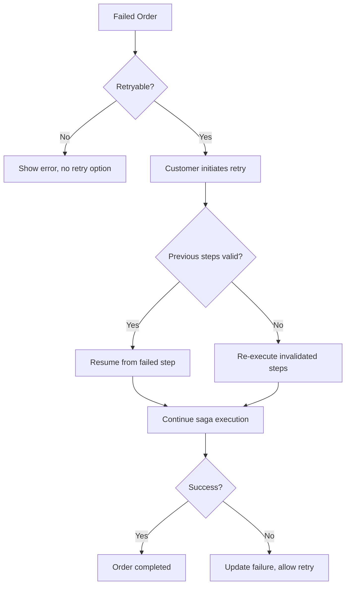
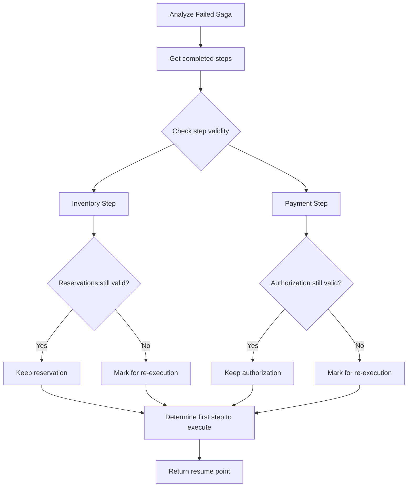
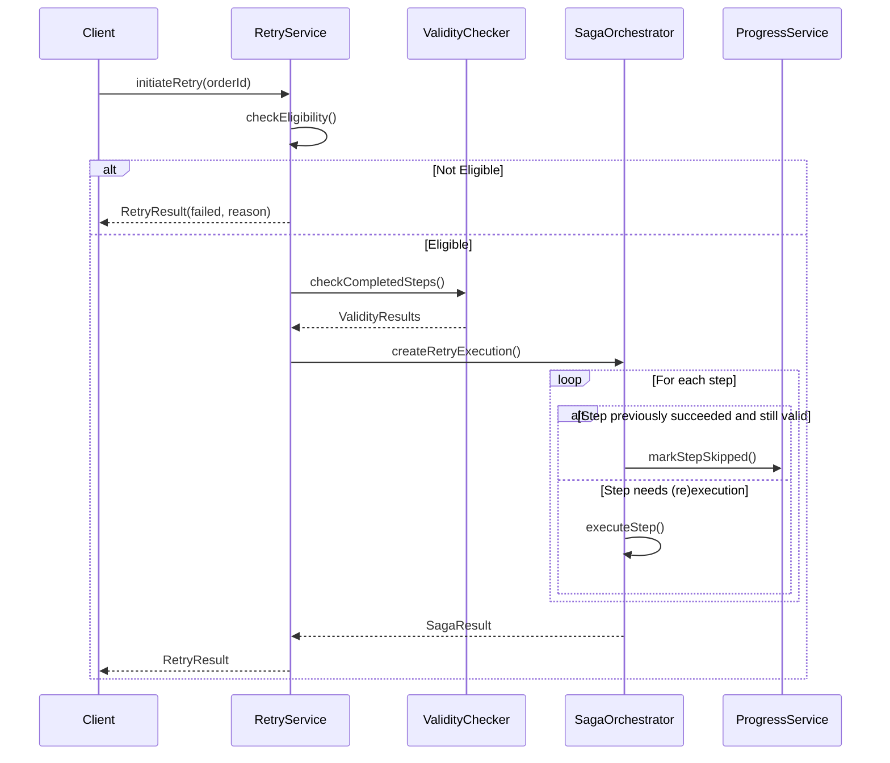
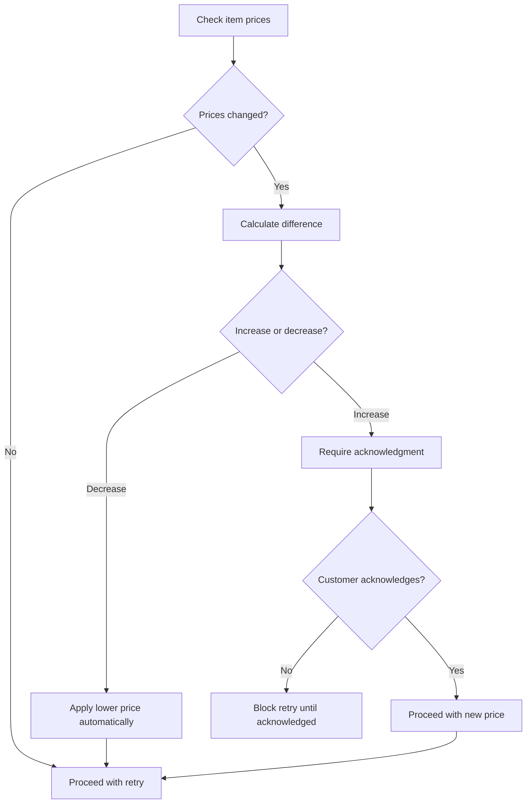

# Implementation Plan: SAGA-004 - Retry Failed Orders

## Overview

Implement the ability for customers to retry failed orders without re-entering information, resuming the saga from the failed step while avoiding unnecessary repetition of successful steps.

## Retry Flow



## Implementation Steps

### 1. Define Retry Eligibility

#### 1.1 Retryable vs Non-Retryable Failures

| Failure Type | Retryable | Reason |
|--------------|-----------|--------|
| Payment declined | Yes | Customer can update payment method |
| Insufficient funds | Yes | Customer can add funds |
| Payment timeout | Yes | Transient failure |
| Item out of stock | Conditional | Only if back in stock |
| Invalid address | Yes | Customer can correct address |
| Service unavailable | Yes | Transient failure |
| Fraud detected | No | Security concern |
| Account suspended | No | Account issue |
| Order cancelled | No | Explicit cancellation |

#### 1.2 RetryEligibility Model

```kotlin
data class RetryEligibility(
    val eligible: Boolean,
    val reason: String?,
    val blockers: List<RetryBlocker>,
    val requiredActions: List<RequiredAction>,
    val expiresAt: Instant?
)

data class RetryBlocker(
    val type: BlockerType,
    val message: String,
    val resolvable: Boolean
)

data class RequiredAction(
    val action: ActionType,
    val description: String,
    val completed: Boolean
)

enum class ActionType {
    UPDATE_PAYMENT_METHOD,
    VERIFY_ADDRESS,
    CONFIRM_ITEM_AVAILABILITY,
    ACCEPT_PRICE_CHANGE
}
```

### 2. Implement Retry Service

#### 2.1 OrderRetryService Interface

```kotlin
interface OrderRetryService {
    fun checkRetryEligibility(orderId: UUID): Mono<RetryEligibility>
    fun initiateRetry(orderId: UUID, retryRequest: RetryRequest): Mono<RetryResult>
    fun getRetryHistory(orderId: UUID): Mono<List<RetryAttempt>>
}
```

#### 2.2 RetryRequest Model

| Field | Type | Description |
|-------|------|-------------|
| orderId | UUID | Order to retry |
| updatedPaymentMethodId | UUID? | New payment method if needed |
| updatedShippingAddress | Address? | Corrected address if needed |
| acknowledgedChanges | List<String> | Price/availability changes accepted |

#### 2.3 RetryResult Model

| Field | Type | Description |
|-------|------|-------------|
| success | Boolean | Whether retry initiated |
| newSagaExecutionId | UUID? | New saga execution if started |
| orderStatus | OrderStatus | Updated order status |
| failureReason | String? | Why retry couldn't start |

### 3. Implement Resume Logic

#### 3.1 Determine Resume Point



#### 3.2 Step Validity Checks

| Step | Validity Check | Expiration |
|------|---------------|------------|
| Inventory Reservation | Reservation not expired | Configurable TTL |
| Payment Authorization | Auth not expired/voided | Card network rules |
| Shipping Arrangement | Quote still valid | Carrier quote TTL |

#### 3.3 StepValidityChecker

```kotlin
interface StepValidityChecker {
    fun isStepResultStillValid(
        stepName: String,
        originalResult: StepResult,
        sagaContext: SagaContext
    ): Mono<ValidityResult>
}

data class ValidityResult(
    val valid: Boolean,
    val reason: String?,
    val canBeRefreshed: Boolean
)
```

### 4. Implement Retry Orchestration

#### 4.1 RetryOrchestrator

```kotlin
class RetryOrchestrator(
    private val sagaOrchestrator: OrderSagaOrchestrator,
    private val validityChecker: StepValidityChecker,
    private val progressService: OrderProgressService
) {
    fun executeRetry(
        originalExecution: SagaExecution,
        retryRequest: RetryRequest
    ): Mono<SagaResult>
}
```

#### 4.2 Retry Execution Flow



### 5. Track Retry Attempts

#### 5.1 RetryAttempt Entity

| Field | Type | Description |
|-------|------|-------------|
| id | UUID | Retry attempt ID |
| orderId | UUID | Associated order |
| originalExecutionId | UUID | Original failed saga |
| retryExecutionId | UUID | New saga execution |
| attemptNumber | Int | Which retry this is |
| initiatedAt | Instant | When retry started |
| resumedFromStep | String | Where execution resumed |
| skippedSteps | List<String> | Steps not re-executed |
| outcome | RetryOutcome | SUCCESS, FAILED, CANCELLED |
| failureReason | String? | Why retry failed |

#### 5.2 Retry Limits

| Configuration | Default | Description |
|---------------|---------|-------------|
| maxRetryAttempts | 3 | Max retries per order |
| retryWindowHours | 24 | Time window for retries |
| cooldownMinutes | 5 | Min time between retries |

### 6. Create Retry API Endpoints

#### 6.1 GET /api/orders/{orderId}/retry-eligibility

**Response:**
```json
{
  "eligible": true,
  "reason": null,
  "blockers": [],
  "requiredActions": [
    {
      "action": "UPDATE_PAYMENT_METHOD",
      "description": "Your card was declined. Please update your payment method.",
      "completed": false
    }
  ],
  "expiresAt": "2024-01-11T14:30:00Z",
  "retryAttemptsRemaining": 2
}
```

#### 6.2 POST /api/orders/{orderId}/retry

**Request:**
```json
{
  "updatedPaymentMethodId": "new-payment-uuid",
  "acknowledgedChanges": ["PRICE_INCREASE_ITEM_123"]
}
```

**Success Response:**
```json
{
  "success": true,
  "orderId": "order-uuid",
  "newExecutionId": "execution-uuid",
  "resumedFromStep": "Payment Processing",
  "skippedSteps": ["Inventory Reservation"],
  "status": "PROCESSING"
}
```

**Failure Response:**
```json
{
  "success": false,
  "orderId": "order-uuid",
  "failureReason": "Maximum retry attempts exceeded",
  "nextAvailableRetry": null
}
```

#### 6.3 GET /api/orders/{orderId}/retry-history

**Response:**
```json
{
  "orderId": "order-uuid",
  "totalAttempts": 2,
  "attempts": [
    {
      "attemptNumber": 1,
      "initiatedAt": "2024-01-10T10:00:00Z",
      "resumedFromStep": "Payment Processing",
      "outcome": "FAILED",
      "failureReason": "Payment declined again"
    },
    {
      "attemptNumber": 2,
      "initiatedAt": "2024-01-10T14:00:00Z",
      "resumedFromStep": "Payment Processing",
      "outcome": "SUCCESS"
    }
  ]
}
```

### 7. Handle Edge Cases

#### 7.1 Price Changes During Retry Window



#### 7.2 Inventory Changes

| Scenario | Handling |
|----------|----------|
| Original reservation expired | Create new reservation |
| Item back in stock | Allow retry with new reservation |
| Item still unavailable | Block retry, notify customer |
| Quantity changed | Require acknowledgment |

#### 7.3 Concurrent Retry Prevention

```kotlin
fun initiateRetry(orderId: UUID, request: RetryRequest): Mono<RetryResult> {
    return orderLockService.acquireLock(orderId)
        .flatMap { lock ->
            checkNoActiveRetry(orderId)
                .flatMap { executeRetry(orderId, request) }
                .doFinally { orderLockService.releaseLock(lock) }
        }
        .onErrorResume(LockAcquisitionException::class.java) {
            Mono.just(RetryResult.retryInProgress())
        }
}
```

## File Structure (Additional)

```
src/main/kotlin/com/pintailconsultingllc/sagapattern/
├── retry/
│   ├── OrderRetryService.kt
│   ├── OrderRetryServiceImpl.kt
│   ├── RetryOrchestrator.kt
│   ├── RetryEligibility.kt
│   ├── RetryRequest.kt
│   ├── RetryResult.kt
│   ├── RetryAttempt.kt
│   └── StepValidityChecker.kt
├── repository/
│   └── RetryAttemptRepository.kt
└── api/
    ├── RetryController.kt
    └── dto/
        ├── RetryEligibilityResponse.kt
        ├── RetryRequestDto.kt
        └── RetryHistoryResponse.kt
```

## Testing Strategy

### Unit Tests

| Test | Description |
|------|-------------|
| Eligibility checks | All retryable/non-retryable scenarios |
| Validity checking | Step result expiration logic |
| Resume point calculation | Correct step identified |
| Retry limits | Enforce max attempts |

### Integration Tests

| Test | Description |
|------|-------------|
| Full retry flow | Successful retry from failed step |
| Skip valid steps | Verify steps not re-executed |
| Concurrent retry | Only one retry at a time |
| Price change handling | Acknowledgment required |

### End-to-End Tests

- Simulate payment failure, update payment, retry
- Retry with expired reservation
- Multiple retry attempts

## Dependencies

| Story | Relationship |
|-------|--------------|
| SAGA-001 | Original saga execution |
| SAGA-002 | Compensation before retry |
| SAGA-003 | Status during retry |
| SAGA-005 | Retry recorded in history |

## Acceptance Criteria Verification

| Criteria | Implementation |
|----------|----------------|
| Retry without re-entering info | Order data preserved, RetryRequest minimal |
| Resume from failed step | StepValidityChecker determines resume point |
| Successful steps not repeated | Valid steps marked SKIPPED in retry |
