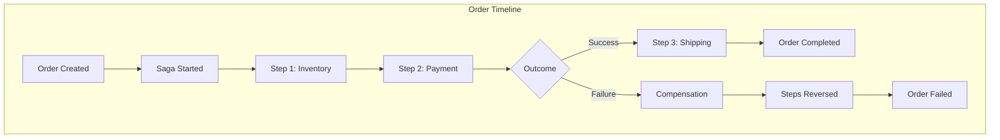
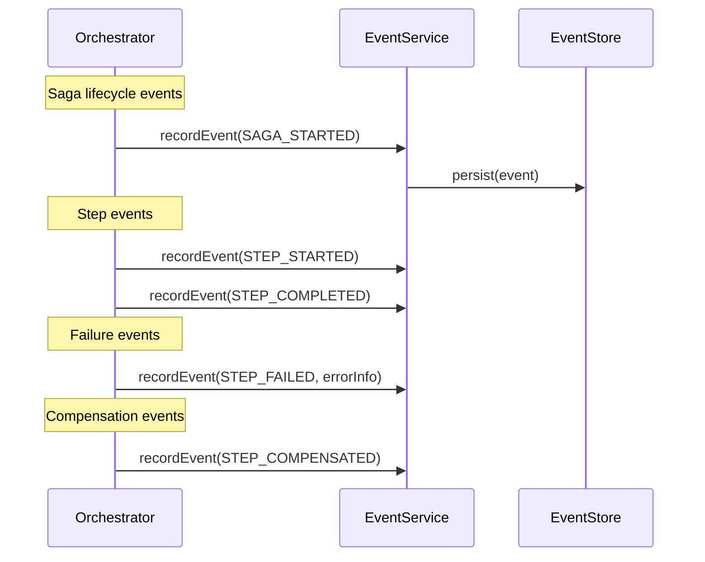
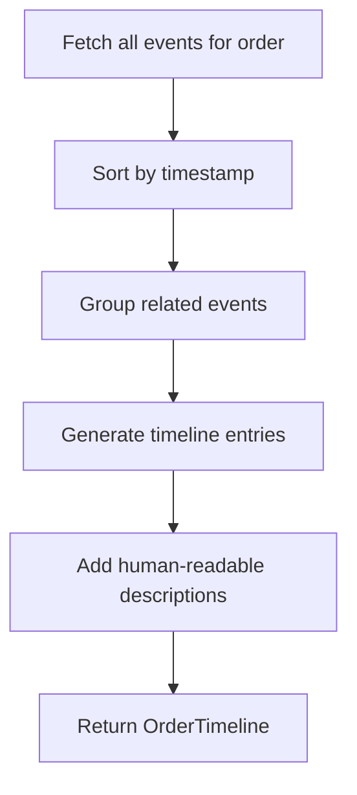

# Implementation Plan: SAGA-005 - Order History Includes Saga Details

## Status: ✅ COMPLETE (2025-12-10)

### Implementation Summary

- **Feature Branch:** `feature/SAGA-005-order-history`
- **Pull Request:** Created via `gh pr create`
- **Tests:** All unit and integration tests passing

### Files Created/Modified

| File | Purpose |
|------|---------|
| `history/OrderEventType.kt` | Enum for all event types |
| `history/EventOutcome.kt` | Enum for event outcomes |
| `history/ErrorInfo.kt` | Error details data class |
| `history/OrderEvent.kt` | Entity with factory methods |
| `history/TimelineStatus.kt` | Timeline entry status enum |
| `history/TimelineEntry.kt` | Timeline entry data class |
| `history/OrderTimeline.kt` | Timeline aggregation model |
| `history/SagaExecutionSummary.kt` | Execution summary model |
| `history/OrderHistory.kt` | Complete history model |
| `history/TimelineDescriptionGenerator.kt` | Human-readable descriptions |
| `history/OrderEventService.kt` | Event recording service |
| `history/OrderHistoryService.kt` | History retrieval service |
| `repository/OrderEventRepository.kt` | Event persistence |
| `api/OrderHistoryController.kt` | REST API endpoints |
| `api/dto/HistoryDtos.kt` | Response DTOs |
| `saga/OrderSagaOrchestrator.kt` | Event recording integration |
| `service/OrderService.kt` | ORDER_CREATED event recording |

---

## Overview

Implement comprehensive order history tracking that captures a full timeline of all saga processing steps, their outcomes, and failure reasons, enabling customers to understand exactly what happened during order processing.

## Infrastructure

> **Prerequisites:** See [000-infrastructure.md](./000-infrastructure.md) for Docker Compose setup.

### Database Tables

Order history persisted in PostgreSQL:

| Table | History Purpose |
|-------|-----------------|
| `order_events` | Immutable event log for each order |
| `saga_executions` | Execution attempts (original + retries) |
| `saga_step_results` | Step-level outcomes |
| `retry_attempts` | Retry history |

### Event Storage Schema

```sql
-- Each significant action recorded as an event
SELECT * FROM order_events
WHERE order_id = :orderId
ORDER BY timestamp;
```

Events include: `ORDER_CREATED`, `SAGA_STARTED`, `STEP_STARTED`, `STEP_COMPLETED`, `STEP_FAILED`, `STEP_COMPENSATED`, `SAGA_COMPLETED`, `SAGA_FAILED`, `RETRY_INITIATED`

## History Model



## Implementation Steps

### 1. Design History Data Model

#### 1.1 OrderHistory Entity

| Field | Type | Description |
|-------|------|-------------|
| id | UUID | History record ID |
| orderId | UUID | Associated order |
| createdAt | Instant | When order was created |
| completedAt | Instant? | When processing finished |
| finalStatus | OrderStatus | Final order state |
| events | List<OrderEvent> | Timeline of events |
| executions | List<SagaExecutionSummary> | All saga attempts |

#### 1.2 OrderEvent Entity

| Field | Type | Description |
|-------|------|-------------|
| id | UUID | Event ID |
| orderId | UUID | Associated order |
| eventType | OrderEventType | Type of event |
| timestamp | Instant | When event occurred |
| stepName | String? | Related step (if applicable) |
| outcome | EventOutcome? | SUCCESS, FAILED, COMPENSATED |
| details | Map<String, Any> | Additional context |
| errorInfo | ErrorInfo? | Error details if failed |

#### 1.3 OrderEventType Enum

| Type | Description |
|------|-------------|
| ORDER_CREATED | Order initially created |
| SAGA_STARTED | Saga execution began |
| STEP_STARTED | Step execution started |
| STEP_COMPLETED | Step finished successfully |
| STEP_FAILED | Step execution failed |
| COMPENSATION_STARTED | Rollback initiated |
| STEP_COMPENSATED | Step successfully reversed |
| COMPENSATION_FAILED | Rollback step failed |
| SAGA_COMPLETED | Saga finished successfully |
| SAGA_FAILED | Saga finished with failure |
| RETRY_INITIATED | Customer initiated retry |
| ORDER_COMPLETED | Order fully processed |
| ORDER_CANCELLED | Order cancelled |

#### 1.4 ErrorInfo Structure

| Field | Type | Description |
|-------|------|-------------|
| code | String | Error code |
| message | String | User-friendly message |
| technicalDetails | String? | Technical error info |
| recoverable | Boolean | Can be retried |
| suggestedAction | String? | What customer can do |

### 2. Implement Event Recording

#### 2.1 OrderEventService

```kotlin
interface OrderEventService {
    fun recordEvent(event: OrderEvent): Mono<OrderEvent>
    fun getEventsForOrder(orderId: UUID): Flux<OrderEvent>
    fun getEventsSince(orderId: UUID, since: Instant): Flux<OrderEvent>
}
```

#### 2.2 Integration Points



#### 2.3 Event Recording in Saga Steps

```kotlin
// In SagaOrchestrator
private fun executeStep(step: SagaStep, context: SagaContext): Mono<StepResult> {
    return eventService.recordEvent(
        OrderEvent(
            orderId = context.orderId,
            eventType = STEP_STARTED,
            stepName = step.getStepName(),
            timestamp = Instant.now()
        )
    )
    .then(step.execute(context))
    .flatMap { result ->
        val eventType = if (result.success) STEP_COMPLETED else STEP_FAILED
        val errorInfo = if (!result.success) ErrorInfo.from(result) else null

        eventService.recordEvent(
            OrderEvent(
                orderId = context.orderId,
                eventType = eventType,
                stepName = step.getStepName(),
                outcome = if (result.success) SUCCESS else FAILED,
                errorInfo = errorInfo
            )
        ).thenReturn(result)
    }
}
```

### 3. Implement History Aggregation

#### 3.1 OrderHistoryService

```kotlin
interface OrderHistoryService {
    fun getOrderHistory(orderId: UUID): Mono<OrderHistory>
    fun getOrderTimeline(orderId: UUID): Mono<OrderTimeline>
    fun getHistoryForCustomer(customerId: UUID, page: Pageable): Flux<OrderHistorySummary>
}
```

#### 3.2 OrderTimeline Model

```kotlin
data class OrderTimeline(
    val orderId: UUID,
    val orderNumber: String,
    val createdAt: Instant,
    val currentStatus: OrderStatus,
    val entries: List<TimelineEntry>
)

data class TimelineEntry(
    val timestamp: Instant,
    val title: String,
    val description: String,
    val status: TimelineStatus,  // SUCCESS, FAILED, COMPENSATED, NEUTRAL
    val stepName: String?,
    val details: Map<String, Any>?
)
```

#### 3.3 Timeline Aggregation Logic



### 4. Create History API Endpoints

#### 4.1 GET /api/orders/{orderId}/history

**Response:**
```json
{
  "orderId": "uuid",
  "orderNumber": "ORD-2024-00123",
  "createdAt": "2024-01-10T10:00:00Z",
  "completedAt": "2024-01-10T10:05:00Z",
  "finalStatus": "COMPLETED",
  "timeline": [
    {
      "timestamp": "2024-01-10T10:00:00Z",
      "title": "Order Placed",
      "description": "Your order was received and is being processed.",
      "status": "SUCCESS"
    },
    {
      "timestamp": "2024-01-10T10:00:05Z",
      "title": "Inventory Reserved",
      "description": "Items have been reserved from our warehouse.",
      "status": "SUCCESS",
      "stepName": "Inventory Reservation"
    },
    {
      "timestamp": "2024-01-10T10:00:15Z",
      "title": "Payment Processed",
      "description": "Payment of $99.99 was successfully charged.",
      "status": "SUCCESS",
      "stepName": "Payment Processing"
    },
    {
      "timestamp": "2024-01-10T10:00:25Z",
      "title": "Shipping Arranged",
      "description": "Your order will be shipped via Standard Delivery.",
      "status": "SUCCESS",
      "stepName": "Shipping Arrangement"
    },
    {
      "timestamp": "2024-01-10T10:00:30Z",
      "title": "Order Complete",
      "description": "Your order has been successfully processed.",
      "status": "SUCCESS"
    }
  ],
  "executionCount": 1
}
```

#### 4.2 Failed Order History Example

```json
{
  "orderId": "uuid",
  "orderNumber": "ORD-2024-00124",
  "finalStatus": "COMPENSATED",
  "timeline": [
    {
      "timestamp": "2024-01-10T11:00:00Z",
      "title": "Order Placed",
      "description": "Your order was received and is being processed.",
      "status": "SUCCESS"
    },
    {
      "timestamp": "2024-01-10T11:00:05Z",
      "title": "Inventory Reserved",
      "description": "Items have been reserved from our warehouse.",
      "status": "COMPENSATED",
      "stepName": "Inventory Reservation"
    },
    {
      "timestamp": "2024-01-10T11:00:15Z",
      "title": "Payment Failed",
      "description": "Your payment could not be processed.",
      "status": "FAILED",
      "stepName": "Payment Processing",
      "error": {
        "code": "PAYMENT_DECLINED",
        "message": "Your card was declined by your bank.",
        "suggestedAction": "Please update your payment method and try again."
      }
    },
    {
      "timestamp": "2024-01-10T11:00:20Z",
      "title": "Inventory Released",
      "description": "Reserved items have been released back to inventory.",
      "status": "COMPENSATED",
      "stepName": "Inventory Reservation"
    },
    {
      "timestamp": "2024-01-10T11:00:25Z",
      "title": "Order Could Not Be Completed",
      "description": "We were unable to complete your order due to a payment issue.",
      "status": "FAILED"
    }
  ]
}
```

#### 4.3 GET /api/orders/{orderId}/events (Detailed)

Returns raw events for technical debugging:

```json
{
  "orderId": "uuid",
  "events": [
    {
      "id": "event-uuid",
      "eventType": "SAGA_STARTED",
      "timestamp": "2024-01-10T10:00:00.123Z",
      "details": {
        "executionId": "exec-uuid",
        "steps": ["Inventory", "Payment", "Shipping"]
      }
    },
    {
      "id": "event-uuid",
      "eventType": "STEP_STARTED",
      "timestamp": "2024-01-10T10:00:00.456Z",
      "stepName": "Inventory Reservation"
    }
  ]
}
```

### 5. Implement Event Storage

#### 5.1 OrderEventRepository

```kotlin
interface OrderEventRepository {
    fun save(event: OrderEvent): Mono<OrderEvent>
    fun findByOrderId(orderId: UUID): Flux<OrderEvent>
    fun findByOrderIdAndTimestampAfter(orderId: UUID, after: Instant): Flux<OrderEvent>
    fun findByCustomerIdOrderByTimestampDesc(customerId: UUID, pageable: Pageable): Flux<OrderEvent>
}
```

#### 5.2 Storage Considerations

| Approach | Pros | Cons |
|----------|------|------|
| Relational table | Queryable, familiar | Schema changes, joins |
| Event store | Append-only, auditable | Specialized infrastructure |
| Document store | Flexible schema | Less queryable |

**Recommended:** Relational table with JSON column for details, enabling both structured queries and flexible data.

### 6. Generate Human-Readable Descriptions

#### 6.1 TimelineDescriptionGenerator

```kotlin
interface TimelineDescriptionGenerator {
    fun generateTitle(event: OrderEvent): String
    fun generateDescription(event: OrderEvent, context: OrderContext): String
}
```

#### 6.2 Description Templates

| Event Type | Title Template | Description Template |
|------------|---------------|---------------------|
| ORDER_CREATED | "Order Placed" | "Your order was received and is being processed." |
| STEP_COMPLETED (Inventory) | "Inventory Reserved" | "Items have been reserved from our warehouse." |
| STEP_COMPLETED (Payment) | "Payment Processed" | "Payment of {amount} was successfully charged." |
| STEP_FAILED (Payment) | "Payment Failed" | "Your payment could not be processed." |
| STEP_COMPENSATED | "{step} Reversed" | "The {step} has been successfully reversed." |
| SAGA_COMPLETED | "Order Complete" | "Your order has been successfully processed." |

### 7. Implement Execution History

#### 7.1 SagaExecutionSummary

| Field | Type | Description |
|-------|------|-------------|
| executionId | UUID | Saga execution ID |
| attemptNumber | Int | Which attempt (1 = original) |
| startedAt | Instant | When execution began |
| completedAt | Instant? | When execution finished |
| outcome | SagaOutcome | SUCCESS, FAILED, COMPENSATED |
| failedStep | String? | Which step failed |
| stepsCompleted | Int | Number of steps completed |
| isRetry | Boolean | Whether this was a retry |

#### 7.2 Multiple Execution Timeline

```json
{
  "orderId": "uuid",
  "executions": [
    {
      "executionId": "exec-1",
      "attemptNumber": 1,
      "outcome": "COMPENSATED",
      "failedStep": "Payment Processing"
    },
    {
      "executionId": "exec-2",
      "attemptNumber": 2,
      "outcome": "SUCCESS",
      "isRetry": true,
      "stepsCompleted": 3
    }
  ]
}
```

## File Structure (Additional)

```
src/main/kotlin/com/pintailconsultingllc/sagapattern/
├── history/
│   ├── OrderEvent.kt
│   ├── OrderEventType.kt
│   ├── OrderHistory.kt
│   ├── OrderTimeline.kt
│   ├── TimelineEntry.kt
│   ├── OrderEventService.kt
│   ├── OrderEventServiceImpl.kt
│   ├── OrderHistoryService.kt
│   ├── OrderHistoryServiceImpl.kt
│   └── TimelineDescriptionGenerator.kt
├── repository/
│   └── OrderEventRepository.kt
└── api/
    ├── OrderHistoryController.kt
    └── dto/
        ├── OrderHistoryResponse.kt
        ├── OrderTimelineResponse.kt
        └── OrderEventsResponse.kt
```

## Visual Timeline Representation

### Success Timeline

```
┌─────────────────────────────────────────────────────────────────┐
│ Order #ORD-2024-00123                              ✓ COMPLETED  │
├─────────────────────────────────────────────────────────────────┤
│                                                                 │
│  ✓ 10:00:00  Order Placed                                      │
│  │           Your order was received                           │
│  │                                                              │
│  ✓ 10:00:05  Inventory Reserved                                │
│  │           Items reserved from warehouse                     │
│  │                                                              │
│  ✓ 10:00:15  Payment Processed                                 │
│  │           $99.99 charged successfully                       │
│  │                                                              │
│  ✓ 10:00:25  Shipping Arranged                                 │
│  │           Standard Delivery selected                        │
│  │                                                              │
│  ✓ 10:00:30  Order Complete                                    │
│              Ready for shipment                                │
│                                                                 │
└─────────────────────────────────────────────────────────────────┘
```

### Failed Timeline

```
┌─────────────────────────────────────────────────────────────────┐
│ Order #ORD-2024-00124                                ✗ FAILED  │
├─────────────────────────────────────────────────────────────────┤
│                                                                 │
│  ✓ 11:00:00  Order Placed                                      │
│  │                                                              │
│  ↶ 11:00:05  Inventory Reserved → Released                     │
│  │           Items released back to inventory                  │
│  │                                                              │
│  ✗ 11:00:15  Payment Failed                                    │
│  │           Card declined by bank                             │
│  │           → Update payment method to retry                  │
│  │                                                              │
│  ✗ 11:00:25  Order Could Not Be Completed                      │
│                                                                 │
└─────────────────────────────────────────────────────────────────┘
```

## Testing Strategy

### Unit Tests

| Test | Description |
|------|-------------|
| Event recording | Events persisted correctly |
| Timeline generation | Correct ordering and grouping |
| Description generation | Human-readable text |
| Compensation history | Reversed steps shown correctly |

### Integration Tests

- Complete saga history
- Failed saga with compensation history
- Multiple retry attempts history
- Customer order history listing

## Dependencies

| Story | Relationship |
|-------|--------------|
| SAGA-001 | Events recorded during execution |
| SAGA-002 | Compensation events recorded |
| SAGA-003 | Status becomes history entry |
| SAGA-004 | Retry attempts in history |

## Acceptance Criteria Verification

| Criteria | Implementation |
|----------|----------------|
| See timeline of all steps | OrderTimeline with ordered entries |
| Each step shows outcome | TimelineEntry.status |
| Failed steps include reason | ErrorInfo in failed events |
